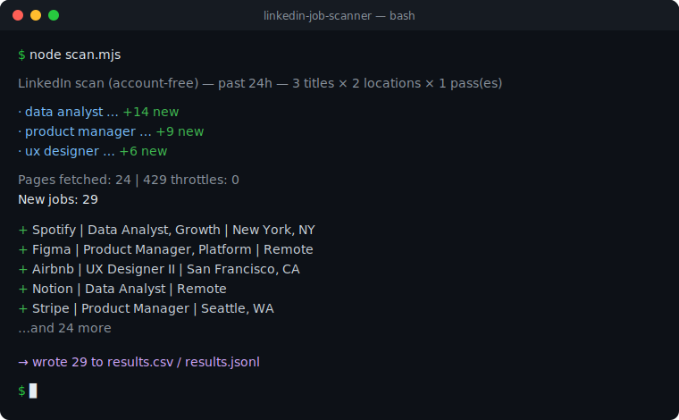

<div align="center">

# 🔍 LinkedIn Job Scanner

**Find fresh LinkedIn jobs from your terminal — no login, no account, no ban risk.**

Set the roles you want once, run one command, get a clean spreadsheet of new postings.

[](https://github.com/ishal1410/linkedin-job-scanner/actions/workflows/ci.yml)
[](LICENSE)
[](https://nodejs.org)


</div>

---

## Why this exists

Scrolling LinkedIn for new jobs is slow, and most "automation" tools ask you to
hand over your LinkedIn password or session cookie — which can get your account
**restricted or banned**, because LinkedIn forbids automating a logged-in session.

This tool never logs in. It reads the same **public** job listings a logged-out
visitor sees, so your account is never involved and never at risk. It just does
the boring part fast and drops the results into a spreadsheet.

<div align="center">
  
</div>

---

## Quick start (5 minutes, no coding needed)

**1. Install Node.js** (only once, if you don't have it)
Download the "LTS" version from **[nodejs.org](https://nodejs.org)** and install it. Done.

**2. Get this tool**
Click the green **`Code`** button above → **Download ZIP** → unzip it.
(Or, if you know git: `git clone https://github.com/ishal1410/linkedin-job-scanner.git`)

**3. Tell it what jobs you want**
Open **`config.json`** in any text editor and change the two lines at the top:

```json
"titles":    ["data analyst", "business analyst"],
"locations": ["United States", "Remote"]
```

That's it — put in whatever roles and places *you* want.

**4. Run it**
Open a terminal **in the tool's folder**, then type `node scan.mjs`.

> **How do I open a terminal in the folder?**
> - **Windows:** open the unzipped folder, right-click an empty area → *Open in Terminal*
>   (or type `cmd` in the folder's address bar and press Enter).
> - **Mac:** right-click the folder → *New Terminal at Folder*.

```bash
node scan.mjs
```

Your results appear in **`results.csv`** — double-click to open it in Excel or
Google Sheets.

---

## Where your results go

| File | What it is |
|------|------------|
| **`results.csv`** | Open in Excel / Google Sheets. Columns: date found, company, title, location, link. |
| `results.jsonl` | Same data, one JSON object per line — handy if you want to script against it. |
| `.seen.txt` | The tool's memory so re-runs don't show you the same job twice. Delete it to start fresh. |

Run it again tomorrow and it only shows you what's **new** since last time.

---

## Make it yours — `config.json`

Everything the tool does is controlled by this one file. **All filters are off by
default**, so you get every fresh job for your titles until you decide to narrow things down.
(Keys starting with `_` are just help notes — leave them alone or delete them; the tool ignores them.)

| Setting | What it does |
|---------|--------------|
| `titles` | The roles to search — exactly what you'd type in LinkedIn's search box. Any field works. |
| `locations` | `"United States"`, a city like `"Austin, Texas, United States"`, a country like `"United Kingdom"`, or `"Remote"`. |
| `freshnessHours` | Only jobs posted within this many hours. Default `24`. |
| `experienceLevels` | `1`=Internship `2`=Entry `3`=Associate `4`=Mid-Senior `5`=Director `6`=Executive. `[]` = all levels. |
| `includeAllExperience` | Also do a pass with no level filter (catches jobs LinkedIn left untagged). |
| `titleMustMatch` | Keep a job only if its title contains one of these words. `[]` = keep all. |
| `titleExclude` | Skip a job if its title contains any of these words. |
| `blockedCompanies` | Companies to always skip. |
| `jdExcludePatterns` | Advanced: reads each full job description and skips it if a pattern matches. Slower. `[]` = off. |
| `maxResultsPerQuery` | Max jobs per search. Default `300`. |

### Handy recipes

Find the matching line in `config.json` and replace it with one of these.
**Copy only the line itself** — `config.json` can't contain `//` comments.

**Only entry-level / new-grad roles**
```json
"experienceLevels": ["1", "2"],
```
**Hide senior and management roles**
```json
"titleExclude": ["senior", "sr", "staff", "principal", "lead", "manager", "director"],
```
**Searching a broad word but only want software roles**
```json
"titleMustMatch": ["software", "backend", "frontend", "full stack"],
```
**Skip jobs that demand 5+ years of experience**
```json
"jdExcludePatterns": ["\\b([5-9]|\\d{2,})\\+?\\s*years"],
```
**Never show me these companies**
```json
"blockedCompanies": ["Acme Corp", "Initech"],
```

---

## Run it on autopilot

Catch jobs the moment they post by running the scanner on a schedule.

**Windows** — open **Task Scheduler** → *Create Basic Task* → set it daily/hourly →
Action: *Start a program* → Program: `node`, Arguments: `scan.mjs`, Start in: the tool's folder.

**Mac / Linux** — `crontab -e`, then add (runs every 6 hours):

```cron
0 */6 * * * cd /path/to/linkedin-job-scanner && node scan.mjs
```

---

## Commands

```bash
node scan.mjs             # find jobs from the last 24h (or your freshnessHours) and save them
node scan.mjs --week      # widen to the last 7 days
node scan.mjs --dry-run   # preview results in the terminal without saving anything
```

---

## FAQ

**Will this get my LinkedIn account banned?**
No. It never logs in and never touches your account — it only reads public listings.

**I got zero results — is it broken?**
Usually your search is too narrow or nothing new was posted in the last 24h. Try
`node scan.mjs --week`, add more `locations`, or broaden your `titles`.

**Do I need a LinkedIn account at all?**
No.

**It says "This needs Node.js 18 or newer."**
Install the LTS version from [nodejs.org](https://nodejs.org) and try again.

**Can I search non-tech jobs?**
Yes — nurse, teacher, accountant, sales, anything. Just put it in `titles`.

---

## Good to know

- The tool paces itself (about one request per second) so LinkedIn doesn't rate-limit it. Please don't speed it up.
- LinkedIn's public feed returns roughly the most recent ~370 jobs per search, so very broad searches hit a ceiling. Narrower searches run more often = better coverage.
- This reads **public** data only. Use it for your own job hunt and follow LinkedIn's terms and your local laws.

## Contributing

Issues and pull requests welcome. The code is small: `scan.mjs` (the scanner),
`lib.mjs` (pure helpers), and `config.json`. Run the tests before opening a PR:

```bash
npm test
```

## License

[MIT](LICENSE) — free to use, modify, and share. No warranty.
