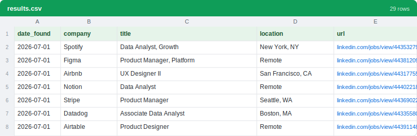

<div align="center">

# LinkedIn Job Scanner

**Pull fresh LinkedIn job postings straight into a spreadsheet, without ever logging in.**

You set your target roles once. After that, one command grabs the newest postings and saves them.

[](https://github.com/ishal1410/linkedin-job-scanner/actions/workflows/ci.yml)
[](LICENSE)
[](https://nodejs.org)


</div>

---

## Why this exists

Checking LinkedIn for new jobs by hand is slow. Most tools that promise to automate it ask for your LinkedIn password or session cookie, which is risky: LinkedIn forbids automating a logged-in session, and accounts that do it can get restricted or banned.

This one never logs in. It reads the same public listings a logged-out visitor sees, so your account stays out of it entirely. It just does the tedious checking for you and writes what it finds to a spreadsheet.

<div align="center">
  
</div>

---

## Quick start (about 5 minutes, no coding needed)

**1. Install Node.js** (once, if you don't already have it)
Grab the "LTS" version from [nodejs.org](https://nodejs.org) and install it.

**2. Get this tool**
Click the green `Code` button above, choose Download ZIP, and unzip it.
If you use git: `git clone https://github.com/ishal1410/linkedin-job-scanner.git`

**3. Tell it what jobs you want**
Open `config.json` in any text editor and change the two lines at the top:

```json
"titles":    ["data analyst", "business analyst"],
"locations": ["United States", "Remote"]
```

Put in whatever roles and places you're actually looking for.

**4. Run it**
Open a terminal in the tool's folder and type `node scan.mjs`.

> Not sure how to open a terminal in the folder?
> - Windows: open the unzipped folder, right-click an empty space, and pick *Open in Terminal* (or type `cmd` in the folder's address bar and press Enter).
> - Mac: right-click the folder and pick *New Terminal at Folder*.

```bash
node scan.mjs
```

The results show up in `results.csv`. Double-click it to open in Excel or Google Sheets.

---

## Where your results go

| File | What it is |
|------|------------|
| `results.csv` | Opens in Excel or Google Sheets. Columns: date found, company, title, location, link. |
| `results.jsonl` | The same data as one JSON object per line, if you want to script against it. |
| `.seen.txt` | The tool's memory so re-runs don't show you the same job twice. Delete it to start over. |

<div align="center">
  
</div>

Run it again tomorrow and you'll only see what's come up since last time.

---

## Make it yours: `config.json`

This one file controls everything. Every filter starts off, so you get every fresh job for your titles until you decide to narrow it down. (Keys that start with `_` are just notes to help you; the tool ignores them, so leave them or delete them.)

| Setting | What it does |
|---------|--------------|
| `titles` | The roles to search, exactly as you'd type them into LinkedIn's search box. Any field works. |
| `locations` | Something like `"United States"`, a city such as `"Austin, Texas, United States"`, a country like `"United Kingdom"`, or `"Remote"`. |
| `freshnessHours` | Only jobs posted within this many hours. Defaults to `24`. |
| `experienceLevels` | `1`=Internship `2`=Entry `3`=Associate `4`=Mid-Senior `5`=Director `6`=Executive. Use `[]` for all levels. |
| `includeAllExperience` | Also run a pass with no level filter, which catches jobs LinkedIn left untagged. |
| `titleMustMatch` | Keep a job only if its title contains one of these words. Use `[]` to keep all. |
| `titleExclude` | Skip a job if its title contains any of these words. |
| `blockedCompanies` | Companies to always skip. |
| `jdExcludePatterns` | Reads each full job description and skips it if a pattern matches. Slower. Use `[]` to turn it off. |
| `maxResultsPerQuery` | Most jobs to pull per search. Defaults to `300`. |

### Handy recipes

Find the matching line in `config.json` and swap in one of these. Copy only the line itself, since `config.json` can't hold `//` comments.

Only entry-level or new-grad roles:
```json
"experienceLevels": ["1", "2"],
```
Hide senior and management roles:
```json
"titleExclude": ["senior", "sr", "staff", "principal", "lead", "manager", "director"],
```
Searching a broad word but you only want software roles:
```json
"titleMustMatch": ["software", "backend", "frontend", "full stack"],
```
Skip jobs that ask for 5 or more years of experience:
```json
"jdExcludePatterns": ["\\b([5-9]|\\d{2,})\\+?\\s*years"],
```
Never show you certain companies:
```json
"blockedCompanies": ["Acme Corp", "Initech"],
```

---

## Run it on autopilot

Run the scanner on a schedule so you catch jobs soon after they post.

On Windows, open Task Scheduler, choose *Create Basic Task*, set it to run daily or hourly, then set the action to *Start a program* with Program `node`, Arguments `scan.mjs`, and Start-in set to the tool's folder.

On Mac or Linux, run `crontab -e` and add this line to run it every six hours:

```cron
0 */6 * * * cd /path/to/linkedin-job-scanner && node scan.mjs
```

---

## Commands

```bash
node scan.mjs             # jobs from the last 24h (or your freshnessHours), saved
node scan.mjs --week      # widen the window to the last 7 days
node scan.mjs --dry-run   # preview in the terminal without saving anything
```

---

## FAQ

**Will this get my LinkedIn account banned?**
No. It never logs in and never touches your account. It only reads public listings.

**I got zero results. Is it broken?**
Usually the search is just too narrow, or nothing new was posted in the last 24 hours. Try `node scan.mjs --week`, add more `locations`, or broaden your `titles`.

**Do I need a LinkedIn account at all?**
No.

**It says "This needs Node.js 18 or newer."**
Install the LTS version from [nodejs.org](https://nodejs.org) and run it again.

**Can I search non-tech jobs?**
Yes. Nurse, teacher, accountant, sales, whatever you want. Just put it in `titles`.

---

## Good to know

- The tool paces itself at roughly one request a second so LinkedIn doesn't rate-limit it. Please don't speed it up.
- LinkedIn's public feed returns about the most recent 370 jobs per search, so very broad searches hit that ceiling. Narrower searches run more often and cover more.
- It reads public data only. Use it for your own job hunt, and follow LinkedIn's terms and your local laws.

## Contributing

Issues and pull requests are welcome. The code is small: `scan.mjs` runs the scan, `lib.mjs` holds the pure helpers, and `config.json` is the settings. Run the tests before you open a PR:

```bash
npm test
```

## License

Licensed under [MIT](LICENSE). Use it, change it, share it. It comes with no warranty.
